# 🎬 Movie Rating Prediction

## 📌 Project Overview

This project predicts movie ratings (`Vote_Average`) using regression models with advanced **feature engineering** techniques. The goal is to demonstrate a complete machine learning pipeline from raw data preprocessing to model evaluation and comparison.

### Key Features
- ✅ Date extraction (year, month, day of week)
- ✅ Language aggregation (top 10 languages + 'other')
- ✅ Genre multi-label encoding using `MultiLabelBinarizer` (top 15 genres + `other_genre` flag)
- ✅ Support for multiple regression algorithms (Linear, Lasso, Ridge)
- ✅ Clean, modular code structure with organized outputs
- ✅ Production-ready preprocessing pipeline

## 📊 Dataset

**Source:** MyMovieDB dataset from Kaggle

**Original features:**
- Title, Release Date, Overview, Poster URL
- Original Language, Genre
- Vote Average (target variable)

**After preprocessing:**
- 38 numerical and binary features
- No missing values
- Outliers removed (ratings < 0.1 and > 9.9)
- Features scaled with StandardScaler

## 🎯 Model Performance

After training three regression models on the feature-engineered dataset:

| Model | R² | RMSE | Best Alpha | Key Insight |
|-------|-----|------|------------|-------------|
| **Linear Regression** | 0.2758 | 0.7955 | N/A | Baseline performance |
| **LassoCV** | 0.2767 | 0.7950 | 0.0027 | Feature selection |
| **RidgeCV** | 0.2753 | 0.7958 | 100.0 | Strong regularization |

### Key Insights
- ✅ All models achieved similar performance (R² ≈ 0.276)
- ✅ Current features explain ~27.6% of rating variance
- ✅ LassoCV successfully reduced feature count without performance loss
- ✅ RidgeCV required strong regularization (alpha = 100)

## 📈 Exploratory Data Analysis

### Correlation Analysis
The strongest correlations with movie rating are very weak (|r| < 0.18), indicating that linear relationships alone cannot capture all factors affecting movie ratings.

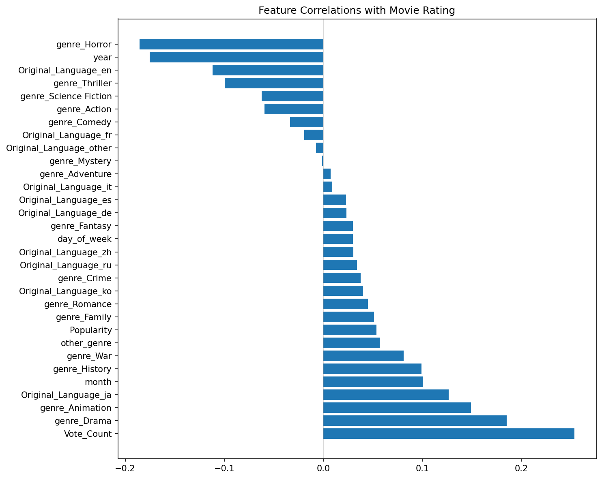

### Rating Distribution
Movie ratings follow an approximately normal distribution centered around 6.5/10, with few extreme outliers.

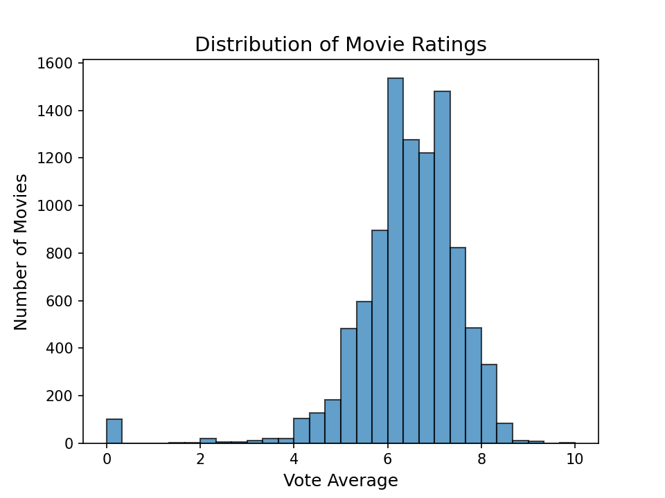

### Genre Analysis
Drama, Animation, and War genres tend to have higher average ratings, while Horror and Thriller show lower ratings.

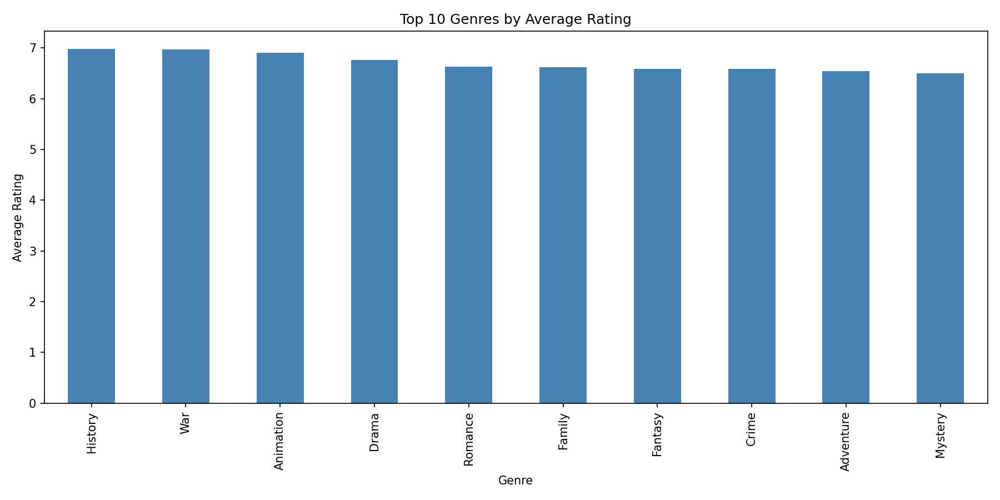

### Yearly Trend
Average movie ratings have remained relatively stable over the years with slight fluctuations.

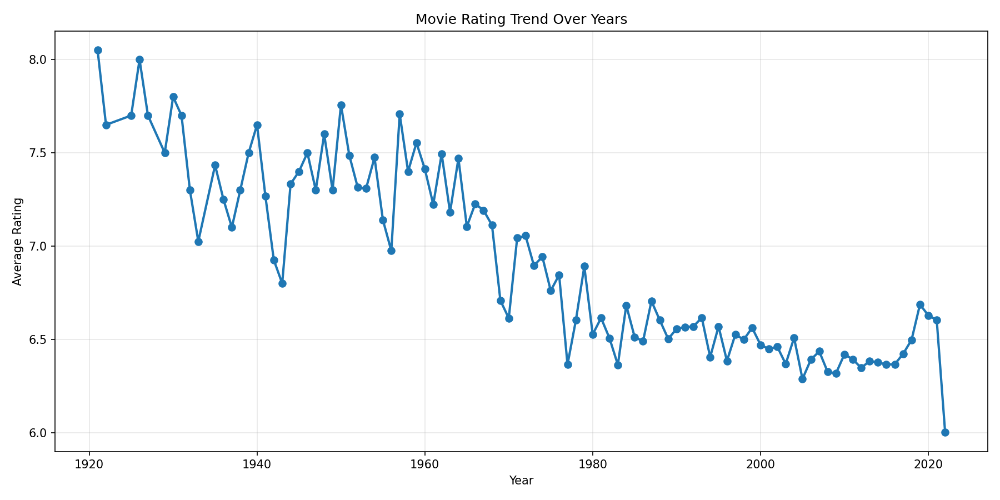

## 🤖 Model Visualizations

### Linear Regression
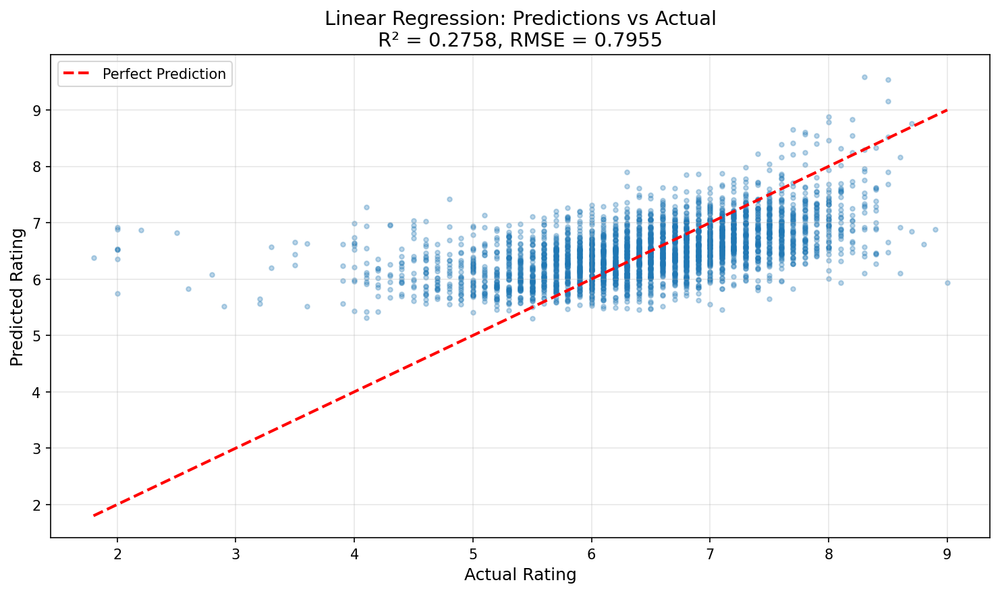
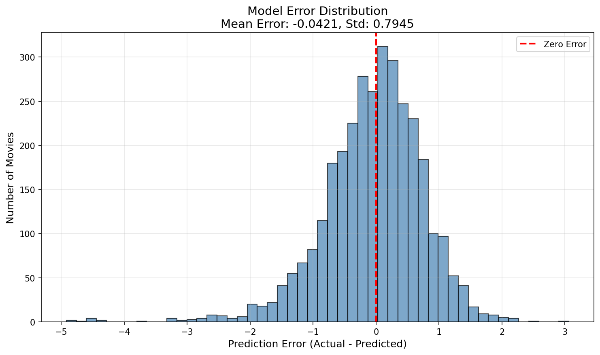

### LassoCV
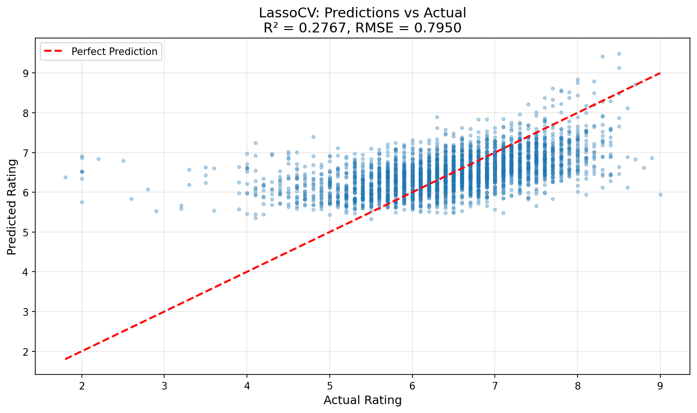
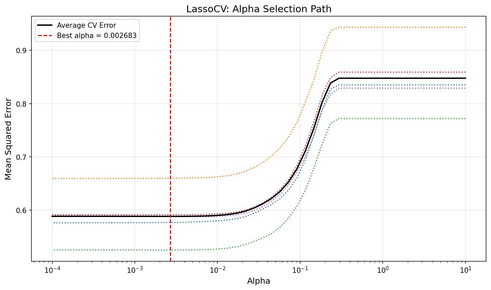

### RidgeCV
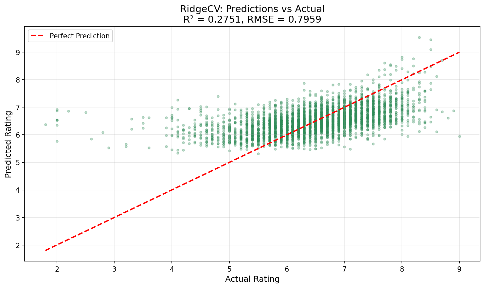
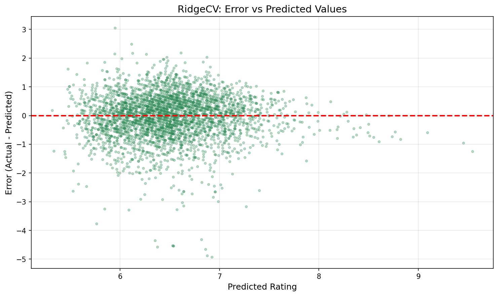

## 📊 Model Comparison

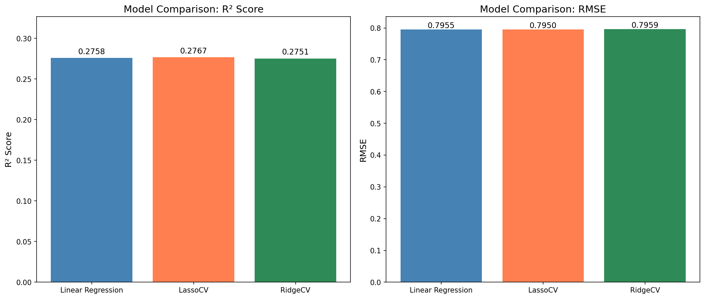

## 🛠 Technologies Used

| Category | Tools |
|----------|-------|
| **Data Processing** | pandas, numpy |
| **Machine Learning** | scikit-learn (LinearRegression, LassoCV, RidgeCV) |
| **Visualization** | matplotlib, seaborn |
| **Model Persistence** | joblib |
| **Development** | Python 3.9+ |

## 📁 Project Structure
movie-ratings-prediction/
│
├── data/
│ └── processed/
│ └── cleaned_movies_v2.csv
│
├── src/
│ ├── 01_feature_engineering.py
│ ├── 02_eda_and_plots.py
│ └── 03_train_models.py
│
├── models/
│ ├── linear_regression_model.pkl
│ ├── lassocv_model.pkl
│ ├── ridgecv_model.pkl
│ └── scaler.pkl
│
├── results/
│ ├── eda/ # Exploratory analysis plots
│ │ ├── correlation_plot.png
│ │ ├── vote_average_distribution.png
│ │ ├── ratings_boxplot.png
│ │ ├── genre_ratings.png
│ │ ├── yearly_trend.png
│ │ └── monthly_ratings.png
│ │
│ ├── models/ # Individual model plots
│ │ ├── linear_regression/
│ │ │ ├── predictions_vs_actual.png
│ │ │ └── error_distribution.png
│ │ ├── lassocv/
│ │ │ ├── predictions_vs_actual.png
│ │ │ ├── alpha_path.png
│ │ │ └── error_distribution.png
│ │ └── ridgecv/
│ │ ├── predictions_vs_actual.png
│ │ ├── error_vs_predicted.png
│ │ └── alpha_path.png
│ │
│ └── comparison/ # Comparative analysis
│ ├── model_comparison_bars.png
│
│
│ 
│
├── requirements.txt
├── .gitignore
└── README.md